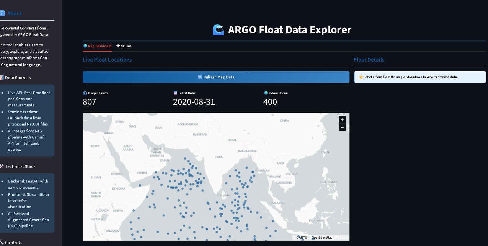
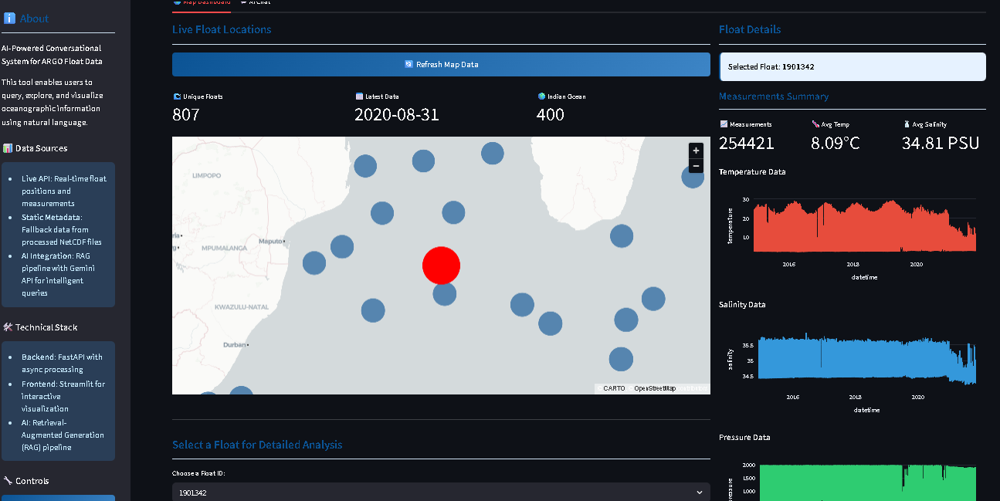
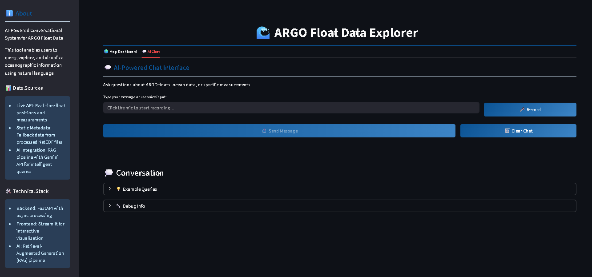

# 🌊 ARGO FloatChat: AI-Powered Ocean Data Explorer with Voice Interface


A sophisticated conversational AI system for exploring and analyzing ARGO float oceanographic data. This application, built for the Smart India Hackathon 2025, combines a real-time data visualization dashboard with a powerful natural language query interface enhanced with voice recognition capabilities.

## 📋 Table of Contents
- [🚀 Key Features](#-key-features)
- [🏗️ Architecture Overview](#️-architecture-overview)
- [🛠️ Technical Stack](#️-technical-stack)
- [📦 Installation & Setup](#-installation--setup)
- [🎯 Usage](#-usage)
- [🔍 API Endpoints](#-api-endpoints)
- [🐛 Troubleshooting](#-troubleshooting)
- [🌟 Acknowledgments](#-acknowledgments)
- [📸 Visual Gallery](#-visual-gallery)

## 🚀 Key Features

### 🌍 Interactive Map Dashboard
- **Hybrid Data Loading**: Initial map view is populated instantly using pre-processed profile summaries for a fast user experience.
- **Smart Selection & Highlighting**: Click any float on the map or select from a dropdown to load its detailed data. The selected float is highlighted with a distinct, larger red marker, and the map automatically zooms in.
- **Multi-Layer Visualization**: A base layer in `PyDeck` shows all active floats in blue, with a dynamic highlight layer for the selected float, providing clear visual context.
- **At-a-Glance Metrics**: The dashboard features styled metric cards displaying the total number of unique floats, the latest data timestamp, and a real-time count of floats in the Indian Ocean region.
- **Enhanced UI Elements**: Improved visual styling with gradient buttons, card-based layouts, and better color schemes for improved user experience.

### 📊 Advanced Data Visualization
- **Live Time-Series Analysis**: When a float is selected, its detailed time-series data is fetched live via the `Argopy` library.
- **Multi-Parameter Charts**: Separate, cleanly styled `Plotly` charts are generated for Temperature, Salinity, and Pressure, allowing for focused analysis.
- **Statistical Summaries**: Key statistics like total measurements, average temperature, and average salinity are calculated and displayed for the selected float.
- **Compact Chart Design**: Optimized chart layouts with improved readability and minimal space usage.

### 💬 AI-Powered Chat Interface with Voice Support
- **Natural Language Queries**: A dedicated chat tab allows users to ask complex questions about ocean data in plain English.
- **🎤 Voice Recognition Feature**: 
  - Continuous speech-to-text capability with real-time transcription
  - Voice input runs in parallel with text input, allowing users to modify transcribed text
  - Say "stop" to end recording automatically
  - Visual feedback during recording with status indicators
  - Resilient to temporary network/API errors during speech recognition
  - Thread-safe implementation with proper queue management for speech processing
- **Text & Voice Integration**: Seamlessly switch between voice and keyboard input, with the ability to edit voice-transcribed text before sending.
- **RAG Pipeline**: Utilizes a Retrieval-Augmented Generation (RAG) pipeline with a `FAISS` vector database to find the most relevant data to answer user questions.
- **Vector Database**: Utilizes Sentence Transformer (intfloat/e5-base-v2). Data is first converted to sentences and then converted to vector embeddings and stored for quick retrieval by FAISS.
- **Gemini Integration**: Powered by Google's `gemini-2.0-flash` model for intelligent, context-aware responses with enhanced query standardization.
- **Multilingual Support**: Supports multiple languages to enhance user experience.
- **Conversational Memory**: The interface displays the last 6 messages, providing context for follow-up questions.
- **Improved UI/UX**: Enhanced chat interface with better message styling, user/assistant differentiation, and cleaner layout.

## 🏗️ Architecture Overview

The system uses a modern, decoupled frontend-backend architecture for performance and scalability. The backend handles data processing and AI, while the frontend focuses on user interaction and visualization with added voice processing capabilities.

```
Frontend (Streamlit) → Backend (FastAPI) → Data Sources
     │                         │
     ├── Map Visualization     ├── Profile Summaries (CSV + FAISS)
     ├── Chat Interface        ├── Live ARGO API (Argopy/Erddap)
     ├── Voice Recognition     ├── Gemini AI Integration
     ├── Charts & Metrics      ├── Async Data Processing
     └── User Controls         └── Multi-source Fallback System
```

## 🛠️ Technical Stack

### Backend
- **Framework**: FastAPI for high-performance, asynchronous API endpoints
- **Data Retrieval**: Argopy to fetch live, detailed time-series data from multiple sources (ERDDAP, GDAC, Argovis) with automatic fallback switching
- **Vector Search**: FAISS for efficient similarity search on ocean data summaries
- **AI & Embeddings**: 
  - Google Gemini 2.5 Flash for generation and query standardization
  - SentenceTransformer (intfloat/e5-base-v2) for text embeddings
- **Caching**: async-lru for in-memory caching of expensive API calls
- **Server**: Uvicorn with CORS middleware for cross-origin requests

### Frontend
- **Framework**: Streamlit for rapid, interactive web app development
- **Mapping**: PyDeck for creating multi-layered, interactive geospatial maps
- **Charting**: Plotly Express for generating responsive and aesthetic time-series charts
- **Speech Recognition**: 
  - SpeechRecognition library with Google Speech-to-Text API
  - Thread-based continuous listening with queue management
  - Resilient error handling and recovery mechanisms
- **State Management**: Enhanced session state handling for voice input, chat history, and UI state persistence

## 📦 Installation & Setup

### Prerequisites
- Python 3.8+
- A Google Gemini API Key
- Microphone access (for voice features)

### 1. Clone the Repository
```bash
git clone https://github.com/ro-lex404/FloatChat
cd FloatChat
```

### 2. Install Dependencies
```bash
pip install -r requirements.txt
```

Note: Ensure `speech_recognition` and `pyaudio` are included for voice features:
```bash
pip install SpeechRecognition pyaudio
```

### 3. Configure Environment
Set your Google Gemini API key as an environment variable.

```bash
# On Linux/macOS
export GEMINI_API_KEY="your-gemini-api-key-here"

# On Windows (Command Prompt)
set GEMINI_API_KEY="your-gemini-api-key-here"
```

### Steps 4 through 6 are optional since we already include the required files for running the application on data from August 2020. However if you want to use for other months and years you have to follow these steps.

### 4. Delete existing files (Best practice) 
Delete `argo_faiss.index`, `argo_profile_summaries.csv` and `argo_metadata1.csv` to avoid file conflicts in further steps.

### 5. Download NetCDF Files 
Run `download_ncfiles.py` and then `csv_file_obtained.py` to download the raw files and then convert it to csv to obtain `argo_metadata1.csv`
```bash
# This script will generate csv file containing all columns like float_id, cycle_number, latitude, longitude, datetime, pressure, temperature, salinity, pres_qc, sal_qc, temp_qc
python download_ncfiles.py
# wait for completion
python csv_file_obtained.py
```

### 6. Prepare Data Files (requires `argo_metadata1.csv`)
The RAG system requires a vector index and pre-processed summary files. Run the provided data preparation script to generate them.

```bash
# This script will create the necessary index and summary files
python create_vector_db.py
```

This will generate `argo_faiss.index` and `argo_profile_summaries.csv`.

### 7. Run the Application (requires `argo_faiss.index` and `argo_profile_summaries.csv`)
You need to run the backend and frontend in two separate terminals.

**Terminal 1: Start the FastAPI Backend**
```bash
uvicorn app_4:app --reload
```
The API will be available at http://localhost:8000.
Wait for INFO: Application startup complete

**Terminal 2: Start the Streamlit Frontend**
```bash
streamlit run streamlit_app5.py
```
The application will open in your browser at http://localhost:8501.

## 🎯 Usage

### Exploring the Map Dashboard
1. Navigate to the 🌍 Map Dashboard tab
2. Interact with the global map to see float locations. Use the Refresh button if needed
3. Click a float on the map or use the "Choose a Float ID" dropdown and click "Load Float Data"
4. The right-hand panel will automatically load and display detailed charts and statistics for the selected float
5. Click "Clear Selection" to reset the view

### Using the AI Chat with Voice
1. Navigate to the 💬 AI Chat Interface tab
2. **Text Input**: Type a question into the input box
3. **Voice Input**: 
   - Click the "🎤 Record" button to start voice recording
   - Speak your question naturally
   - Say "stop" or click "Stop Recording" to end the recording
   - The transcribed text will appear in the input box where you can edit it if needed
   - Click "Send Message" to submit your query
4. The AI will use the ARGO database context to formulate a response
5. Use the "Example Queries" expander for ideas

### Voice Recognition Tips
- Ensure your microphone is properly configured and has permissions
- Speak clearly for best transcription accuracy
- The system will show "🎤 Listening..." status while recording
- You can combine voice and text input by editing the transcribed text
- If recording fails, the system will show an error message and allow you to retry

## 🔍 API Endpoints

The FastAPI backend provides the following key endpoints:

- **GET /api/live/map_data**: Provides summarized location data for all floats from `argo_profile_summaries.csv` to populate the initial map view
- **GET /api/live/float/{float_id}**: Fetches detailed, live time-series data (temp, salinity, pressure) for a specific float ID using Argopy with multi-source fallback
- **POST /query**: Accepts a natural language query and processes it through the RAG pipeline with Gemini-powered standardization
- **GET /api/status**: Checks the operational status of all data sources (GDAC, ERDDAP, Argovis)
- **GET /api/debug/available_floats**: Debug endpoint to check available float IDs in the database
- **GET /health**: A comprehensive health check endpoint to verify that all components are loaded correctly

You can view interactive API documentation at http://localhost:8000/docs.

## 🐛 Troubleshooting

### Common Issues
- **Port conflicts**: If ports 8000 or 8501 are busy, change them in `uvicorn`/`streamlit` commands
- **API key errors**: Ensure `GEMINI_API_KEY` is set in your environment variables
- **Data file issues**: Delete and regenerate `argo_faiss.index` if you encounter loading errors
- **Voice recognition not working**: 
  - Check microphone permissions in your system settings
  - Ensure `pyaudio` is properly installed (`pip install pyaudio`)
  - On Linux, you may need: `sudo apt-get install portaudio19-dev`
  - On macOS with M1/M2: Use `brew install portaudio` before installing pyaudio
- **Speech API errors**: The system will continue listening even with temporary API failures
- **Thread management issues**: The app automatically handles thread cleanup and recovery

### Debug Mode
The application includes debug information in the chat interface:
- Access the "🔧 Debug Info" expander to see:
  - Current listening status
  - Speech queue status
  - Thread health
  - Session state details

## 🌟 Acknowledgments

- The ARGO Program for providing the comprehensive, open-source oceanographic data that powers this application
- Google for the powerful Gemini models that enable our natural language interface
- The developers and communities behind FastAPI, Streamlit, FAISS, SpeechRecognition, and the entire Python data science ecosystem
- Smart India Hackathon 2025 for providing the platform and opportunity to build innovative solutions

## 📸 Visual Gallery

### 🌍 Interactive Map Dashboard

*Global view of ARGO float positions with real-time data loading and enhanced UI elements*

### 📊 Data Visualization

*Multi-parameter analysis with temperature, salinity, and pressure profiles in compact, styled charts*

### 💬 AI Chat Interface with Voice  

*Natural language queries with voice input support and context-aware responses*

### 🎤 Voice Recording Feature

*Real-time speech-to-text transcription with visual feedback and error resilience*
